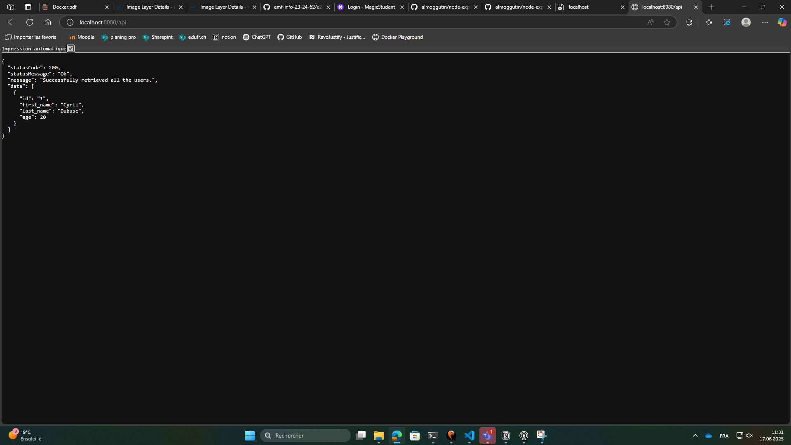

# Documentation technique

Pour commencer j'ai été sur la doc du repo, et j'ai vue qu'il faillais utiliser node, puis git le repo.
Il fallais créé un fichier .env 
Puis j'ai fais "RUN npm install" avec le fichier package.json du git.

Après j'ai du créé un docker-compose.yml avec dessue le servide du Dockerfile et un service db, pour créé la database.
J'ai ajouter les variable d'environement pour la connection du backend.
J'ai créé un volume mysql-data et un autre pour effectuer le script sql.


## commande de lancement 
```bash
docker compose up --build
```


## Vue de la database 
